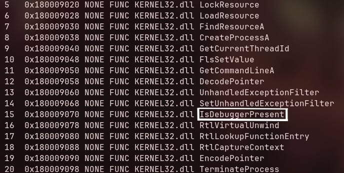
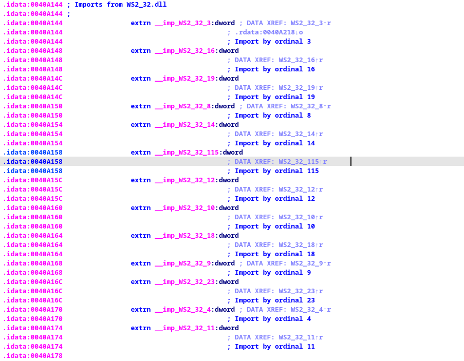

# Dokumentasi Analisis Malware: WannaCry (Varian Copycat)

**Tanggal Analisis:** 2 Juli 2026

**Analis Utama:** @123Aaaakh 

**Target File:** Biner WannaCry (Varian *Dropper* & *Payload* Utama)

**Alat Utama:** radare2 (r2)

## Ringkasan Eksekutif (Executive Summary)

Malware yang dianalisis teridentifikasi sebagai varian modifikasi (*copycat*) dari **WannaCry (WanaCrypt0r 2.0)**. Biner ini merupakan hibrida dari tiga komponen utama:

1. **Dropper:** Modul pengantar untuk menyembunyikan file dari deteksi awal.
2. **Worm:** Modul jaringan otonom yang menyebar lewat celah keamanan.
3. **Ransomware:** Modul pemeras untuk mengenkripsi data pengguna.

Modifikasi paling krusial pada varian ini adalah penghancuran mekanisme *Kill-Switch* melalui teknik *binary patching*, membuat malware ini kebal terhadap penonaktifan domain dan akan selalu mengeksekusi proses enkripsi.

## Fase 1: Analisis Dropper (Sistem Pengantar)

Pada tahap awal, analisis dilakukan pada *file* PE (Portable Executable) terluar.

### Penemuan Kunci:

- **Anti-Analysis:** Ditemukan *import* fungsi IsDebuggerPresent dari KERNEL32.dll, membuktikan malware mencoba mendeteksi keberadaan *debugger/sandbox* analisis.
- **Matryoshka Technique:** Malware tidak berisi Ransomware yang langsung dieksekusi, melainkan menggunakan fungsi *Resource Management* Windows (FindResourceA, LoadResource, SizeofResource, LockResource) untuk membuka file lain yang disembunyikan di dalam badannya sendiri (Sektor .rsrc).
- **Execution:** Menggunakan CreateFileA, WriteFile, dan CreateProcessA untuk menulis dan menjalankan payload tersembunyi ke memori (biasanya disamarkan sebagai tasksche.exe).



## Fase 2: Ekstraksi Payload (Manual Unpacking)

Menggunakan radare2, kita melakukan ekstraksi komponen tersembunyi dari sektor .rsrc.

### Langkah Ekstraksi:

1. Perintah `iR` mengidentifikasi file raksasa berukuran **5MB** di alamat memori (offset) `0x1800110a4`.
2. Pencarian *Magic Bytes* mengonfirmasi adanya *header* **`MZ** (4d 5a)`, yang merupakan tanda valid dari sebuah file biner .exe Windows.
3. Ekstraksi dilakukan dengan memotong 5 juta byte data menggunakan perintah `wt payload.exe 0x500000`.

## Fase 3: Analisis Payload Utama (Kill-Switch Bypass)

Payload 5MB yang berhasil diekstrak kemudian dianalisis. Di sinilah modifikasi mematikan dari peretas pihak ketiga ditemukan.

### Modifikasi Domain URL:

Malware mencoba menghubungi URL *Kill-Switch* melalui fungsi `InternetOpenUrlA` dari `WININET.dll`. Namun, URL aslinya telah dimodifikasi (melalui Hex Editor) menjadi:

[http://www.iuqerfsodp9ifjaposdfjhgosurijfaewrwergwff.com](http://www.iuqerfsodp9ifjaposdfjhgosurijfaewrwergwff.com) (Berakhiran **gwff.com**).

### NOP Sled Patching (Kerusakan Rem Darurat):

Hasil *disassembly* (pdf) pada fungsi main menunjukkan manipulasi logika :

```nasm
0x004081a3  test edi, edi   ; Cek status koneksi (sukses/gagal)
0x004081a5  nop             ; DITAMBAL (Sebelumnya JE/JNE)
0x004081a6  nop             ; DITAMBAL
```

Instruksi percabangan (`JE/JNE`) dihapus dan diganti dengan instruksi hampa **`NOP** (0x90 0x90)`. Hal ini memaksa program untuk "jatuh lurus" (*fall-through*) mengeksekusi Ransomware, mengabaikan apa pun respons dari koneksi internet.

## Fase 4: Analisis Mekanisme Worm Jaringan

Berbeda dengan rumor yang menyebutnya sebagai *Botnet* (yang pasif menunggu perintah C2), WannaCry terbukti sebagai **Worm Otonom**.

### Import by Ordinal (WS2_32.dll):

Malware memanggil pustaka komunikasi jaringan menggunakan nomor urut (*Ordinal*) untuk menyembunyikan niatnya dari Antivirus. Dekode ordinal menunjukkan:

- **`Ordinal 23 (socket), 4 (connect), 19 (send)`:** Digunakan untuk secara agresif memindai IP jaringan lokal dan menembakkan *payload* eksploitasi (EternalBlue) secara langsung ke **Port 445 (SMB)**.
- Tidak ada indikasi menunggu perintah (*listen for commands*) dari *server* pusat untuk memulai serangan; infeksi menyebar secara otomatis layaknya wabah.



## Fase 5: Kriptografi dan Infrastruktur C2

Pencarian daftar ekstensi file (.doc, .pdf, dll) pada awalnya tidak membuahkan hasil karena teknik enkripsi internal. Namun, pencarian kata kunci spesifik mengungkap brankas rahasia WannaCry.

### Artefak yang Ditemukan:

1. **Password Statis:** Ditemukan *string* `WNcry@2ol7`. Ini adalah *password* arsip (ZIP) yang tertanam statis untuk mengekstrak komponen Ransomware dari memori.
2. **Komponen Senjata Utama (Ekstensi .wnry):**
    - `t.wnry`: File .dll berisi modul Ransomware inti (kriptografi AES/RSA) dan target ekstensi.
    - `c.wnry`: Konfigurasi *Command and Control* (C2).
    - `s.wnry / r.wnry`: Modul klien jaringan **Tor** mini.
3. **Globalisasi Serangan:** Ditemukan tumpukan file bahasa (contoh: `msg/m_indonesian.wnry, msg/m_english.wnry`) yang berisi pesan tebusan (*ransom note*) dalam lebih dari 28 bahasa.

---
